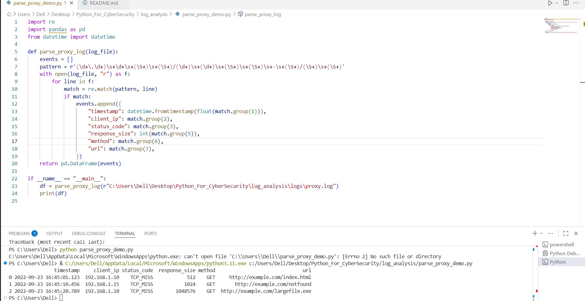
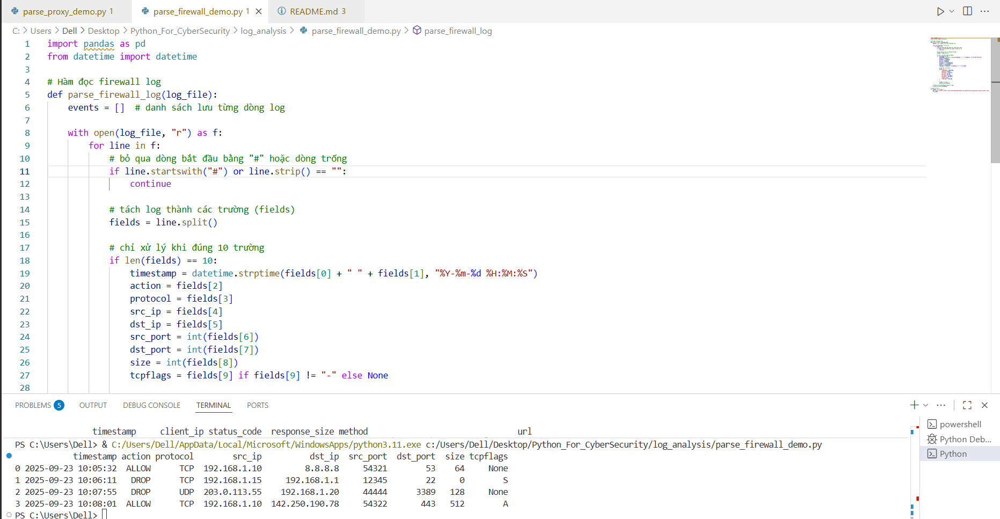

# demo
Proxy Log Analysis

Dòng 1: Client 192.168.1.10 truy cập index.html (hợp lệ).

Dòng 2: Client 192.168.1.15 gặp lỗi 404 Not Found.

Dòng 3: Client 192.168.1.10 tải về largefile.exe (1MB) → có thể là tải file thực thi → rủi ro malware.

👉 Tác dụng: Proxy log giúp theo dõi ai truy cập web gì, khi nào, và phát hiện download nguy hiểm hoặc lỗi HTTP.
Firewall Log Analysis (parse_firewall_demo.py)

Dòng 1: ALLOW truy vấn DNS tới 8.8.8.8 → hợp lệ.

Dòng 2: DROP SSH (22/tcp) từ 192.168.1.15 tới router → nghi ngờ brute force SSH.

Dòng 3: DROP RDP (3389/udp) từ IP ngoài 203.0.113.55 → scan RDP từ Internet.

Dòng 4: ALLOW kết nối HTTPS tới 142.250.190.78 (Google) → hợp lệ.

👉 Tác dụng: Firewall log cho thấy nỗ lực tấn công (scan SSH/RDP) và lưu lượng bình thường (DNS, HTTPS).